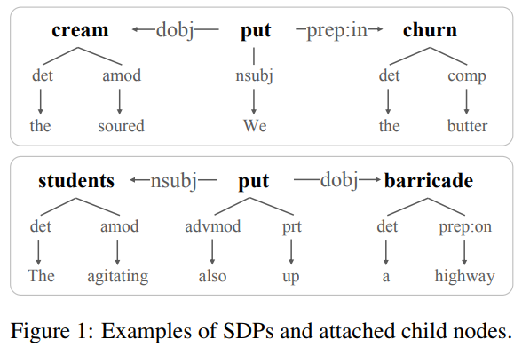
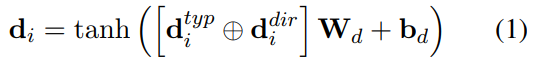
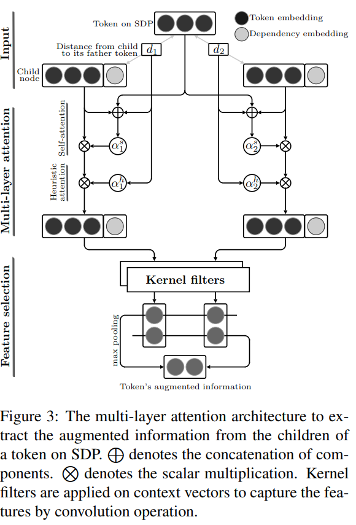

# A Richer-but-Smarter Shortest Dependency Path with Attentive Augmentation for Relation Extraction 내용정리

## 0. Abstract

- 관계 추출의 두개의 공통된 접근법
  1. SDP 이용
  2. 문맥 정보를 잡아내는 attention model 이용

- 각각의 접근방식은 정보를 잃거나 불필요한 정보를 가지는 단점이 있음
- 그래서 두 개의 접근방법의 장점을 통합한 모델 제안
- RbSP라고 불리는 모델은 SDP의 기본 정보에 attention 메커니즘에 의해 선택된 정보를 기반으로 함
- sentence에는 LSTM 네트워크 모델을 이용하고 RbSP에서는 CNN을 통합해서 deep neural model을 개발
- dataset으로 SemEval-2010 dataset 이용

## 1. Introduction

### 소개

- 최근 연구를 통해 SDP 정보를 사용한 방법이 전체 문장을 사용한 방법보다 더 좋은 결과를 낸다고 보여짐
- 그러나 SDP만을 이용한 접근 방법은 유용한 정보를 빠뜨릴 수 있다는 단점이 있음
- attention 메커니즘은 target 단어와 관계있는 워드들을 주목해서 의미있는 정보를 결정할 수 있다.
- 그러나 attention 메커니즘은 dependency tree의 구조적 정보를 사용하지 않는다.

---------

### 모델 제안

- 그래서 SDP와 attention 메커니즘 접근 방법의 장점을 결합한 모델을 제안
- 기본적으로 함축된 semantic, syntactic 정보에 주목, SDP의 단점인 정보를 놓치는 것들을 보완하기 위해 full dependency parse tree에서 온 syntactic 정보를 활용
- 종속 관계는 head word(부모, 술어)와 dependent word(자식, 인자) 사이에 있기 때문에 dependency tree에서 단어의 모든 chilid node들을 사용하여 정보를 증가시킨다
- 모든 자식을 쓰는 것은 성능 향상에 유용하지 않기 때문에 커널 필터를 attention 메커니즘과 함께 사용하여 관련있는 자식들만 선택한다. 이것이 RbSP
- LSTM과 multi-attention layer를 포함한 CNN을 혼합한 새로운 DNN framework를 제안한다.

------------

### 이 모델의 contributions

- SDP의 단점을 극복하기 위해 attentive augmented SDP를 기반으로한 새로운 relation representation을 제안함
- context vector들의 feature들을 잡아내는 kernel filter를 사용한 attention 메커니즘
- 제안한 RbSP와 다른 유형의 linguistic, architectural feature를 사용한 DNN architecture 제안

## 2. Related Work

- Unsupervised, semi-supervised, distant supervision 기법들이 relation extraction task에 효과적이었다.
- 이 논문은 정확도가 보통 높은 supervised 기법들에 대해 주목
- 초장기 연구들에서 다양한 종류의 언어적 특징을 뽑아내는데 집중함 ex) syntactic, semantic
- 하지만 이러한 feature들은 명시적 언어 사전 처리 단계에서 설계된 feature의 품질에 크게 의존
- SDP가 relation extraction을 위한 효율적인 정보를 가지고 있어서 많은 연구에서 사용하게 됨 ex) negative sampling, BRCNN(directed shortest path)
- 최근에는 attention 메커니즘을 이용해 의미있는 정보에 집중하는 model도 있다.

## 3. Richer-but-Smarter SDP

- 이전에 말했듯이 SDP의 함축된 정보를 이용
- 단순한 SDP구조는 SDP에 나타나지 않는 유용한 정보가 있어서 약점이 된다.
- 이러한 놓친 정보들은 관계를 더 정확하게 나타내기 위해 활용 될 수 있다.

(i) We put the soured [cream]e1 in the butter [churn]e2 and started stirring it.
(ii) The agitating [students]e1 also put up a [barricade]e2 on the Dhaka-Mymensingh highway.

- 예를들어 다른 종류의 relation type이 있는데 두 문장 모두 두개의 entity path에 put 단어만 있다. 그러나 두 개의 SDP에서 put의 의미는 완벽히 다르다. 이런 경우에 기계는 두 개의 SDP를 구별해내기가 어렵다.

- 이 문제를 해결하기 위해 child node를 SDP에 포함시키는것이 relation classification을 위한 추가적인 정보를 제공한다.

## 4. Proposed Model

RbSP의 전체 모델

### SDP Representation

- dependency relation을 위해 dependency type과 dependency direction을 concatenate해서 embedding을 형성
- 최종적으로 D-dimensional representation

$$
d_i = tanh([d_i^{typ}⊕d_i^{dir}]W_d+b_d)
$$

- token representation을 위해 4개 타입의 embedding을 이용한다.
  - ___Pre-trained fastText embeddings___
  - ___Character-based embeddings___
  - ___POS tag embeddings___
  - ___WordNet embeddings___

- 최종적으로 X-dimensional vector형태의 representation이 된다.

$$
x_i = tanh([t_i ⊕a_i ⊕h_i]W_x + b_x)
$$

### Multi-layer attention with Kernel filters

- 정확환 augmented information을 child nodes로 부터 뽑기 위해 multi-layer attention with kernel filters 구조를 제안한다.

