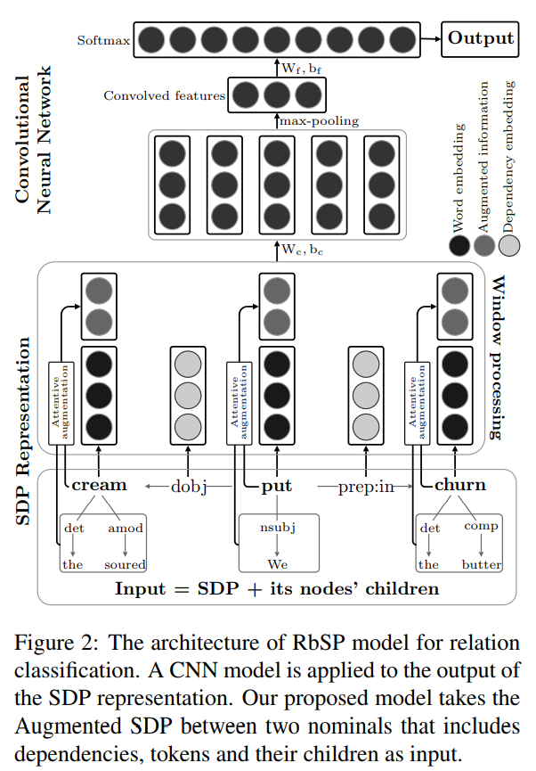

# A Richer-but-Smarter Shortest Dependency Path with Attentive Augmentation for Relation Extraction 내용정리

## 0. Abstract

- 관계 추출의 두개의 공통된 접근법
  1. SDP 이용
  2. 문맥 정보를 잡아내는 attention model 이용

- 각각의 접근방식은 정보를 잃거나 불필요한 정보를 가지는 단점이 있음
- 그래서 두 개의 접근방법의 장점을 통합한 모델 제안
- RbSP라고 불리는 모델은 SDP의 기본 정보에 attention 메커니즘에 의해 선택된 정보를 기반으로 함
- sentence에는 LSTM 네트워크 모델을 이용하고 RbSP에서는 CNN을 통합해서 deep neural model을 개발
- dataset으로 SemEval-2010 dataset 이용

## 1. Introduction

### 소개

- 최근 연구를 통해 SDP 정보를 사용한 방법이 전체 문장을 사용한 방법보다 더 좋은 결과를 낸다고 보여짐
- 그러나 SDP만을 이용한 접근 방법은 유용한 정보를 빠뜨릴 수 있다는 단점이 있음
- attention 메커니즘은 target 단어와 관계있는 워드들을 주목해서 의미있는 정보를 결정할 수 있다.
- 그러나 attention 메커니즘은 dependency tree의 구조적 정보를 사용하지 않는다.

---------

### 모델 제안

- 그래서 SDP와 attention 메커니즘 접근 방법의 장점을 결합한 모델을 제안
- 기본적으로 함축된 semantic, syntactic 정보에 주목, SDP의 단점인 정보를 놓치는 것들을 보완하기 위해 full dependency parse tree에서 온 syntactic 정보를 활용
- 종속 관계는 head word(부모, 술어)와 dependent word(자식, 인자) 사이에 있기 때문에 dependency tree에서 단어의 모든 chilid node들을 사용하여 정보를 증가시킨다
- 모든 자식을 쓰는 것은 성능 향상에 유용하지 않기 때문에 커널 필터를 attention 메커니즘과 함께 사용하여 관련있는 자식들만 선택한다. 이것이 RbSP
- LSTM과 multi-attention layer를 포함한 CNN을 혼합한 새로운 DNN framework를 제안한다.

------------

### 이 모델의 contributions

- SDP의 단점을 극복하기 위해 attentive augmented SDP를 기반으로한 새로운 relation representation을 제안함
- context vector들의 feature들을 잡아내는 kernel filter를 사용한 attention 메커니즘
- 제안한 RbSP와 다른 유형의 linguistic, architectural feature를 사용한 DNN architecture 제안

## 2. Related Work

- Unsupervised, semi-supervised, distant supervision 기법들이 relation extraction task에 효과적이었다.
- 이 논문은 정확도가 보통 높은 supervised 기법들에 대해 주목
- 초장기 연구들에서 다양한 종류의 언어적 특징을 뽑아내는데 집중함 ex) syntactic, semantic
- 하지만 이러한 feature들은 명시적 언어 사전 처리 단계에서 설계된 feature의 품질에 크게 의존
- SDP가 relation extraction을 위한 효율적인 정보를 가지고 있어서 많은 연구에서 사용하게 됨 ex) negative sampling, BRCNN(directed shortest path)
- 최근에는 attention 메커니즘을 이용해 의미있는 정보에 집중하는 model도 있다.

## 3. Richer-but-Smarter SDP

- 이전에 말했듯이 SDP의 함축된 정보를 이용
- 단순한 SDP구조는 SDP에 나타나지 않는 유용한 정보가 있어서 약점이 된다.
- 이러한 놓친 정보들은 관계를 더 정확하게 나타내기 위해 활용 될 수 있다.

(i) We put the soured [cream]e1 in the butter [churn]e2 and started stirring it.
(ii) The agitating [students]e1 also put up a [barricade]e2 on the Dhaka-Mymensingh highway.

- 예를들어 다른 종류의 relation type이 있는데 두 문장 모두 두개의 entity path에 put 단어만 있다. 그러나 두 개의 SDP에서 put의 의미는 완벽히 다르다. 이런 경우에 기계는 두 개의 SDP를 구별해내기가 어렵다.

- 이 문제를 해결하기 위해 child node를 SDP에 포함시키는것이 relation classification을 위한 추가적인 정보를 제공한다.

## 4. Proposed Model

RbSP의 전체 모델

### SDP Representation

- dependency relation을 위해 dependency type과 dependency direction을 concatenate해서 embedding을 형성
- 최종적으로 D-dimensional representation

- token representation을 위해 4개 타입의 embedding을 이용한다.
  - ___Pre-trained fastText embeddings___
  - ___Character-based embeddings___
  - ___POS tag embeddings___
  - ___WordNet embeddings___

- 최종적으로 X-dimensional vector형태의 representation이 된다.

### Multi-layer attention with Kernel filters

- 정확환 augmented information을 child nodes로 부터 뽑기 위해 multi-layer attention with kernel filters 구조를 제안한다.

-------

#### Input

- 하나의 token t 와 그것들의 child node들이 주어지면, 첫번째로 모든 토근을 vector로 표현한다.
- Token t는 word embedding과 part-of-speech tag embedding으로 concatenation한 vector로 표현한다.
- children의 token의 모든 정보를 활용하기 위해 token embedding뿐만 아니라 dependency relation 정보를 이용
- 추가적으로 child node와 target token과의 정보를 잡기 위해서 position embeddings 사용

#### Multi layer attention

- self-attentive network 부모노드의 정보와 distance를 concatenation 해서 계산

- 최종 self-attentive context vector

- heuristic attentive layer based on the distances

- Kernel filters

- The final augmented (max-pooling) 

### CNN on RbSP

- SDP representation layer를 거친 후에 input SDP는 이렇게 변화했다.

- 일반적으로 i:i+j까지 concatenation을 한다.(j tokens, j-1 dependency relation)

- r 사이즈의 window에서 k개의 필터로 convolution operation을 한다. 그후 max-pooling 방식을 통해 가장 중요한 feature를 모은다.
- 그 후 softmax를 거쳐서 prediction

### Model Training

- Loss function

### Additional techniques

- pre-trained fastText word embedding 사용
- dependency embedding, word character, POS tags를 위한 look-up tabel은 랜덤하게 Glorot initializer를 사용해 구성 그리고 training 하면서 학습됨

## 5. Experimental Evaluation

### Dataset

- SemEval-2010 Task 8 dataset
- Precision, Recall, F1 score로 비교

### Performance of the RbSP Model

### Contribution of different components

- ablation study

### Results Analysis

## 6. Conclusions

In this paper, we have presented RbSP, a novel representation of relation between two nominals in a
sentence that overcomes the disadvantages of traditional SDP. Our RbSP is created by using multilayer attention to choose relevant information to
augment a token in SDP from its child nodes. We
also improved the attention mechanisms with kernel filters to capture the features on the context
vector. We evaluated our model on SemEval-2010
task 8 dataset, then compared the results with very
recent state-of-the-art models. Experiments were
also constructed to verify the rationality and effectiveness of each of the model’s components and
information sources. The results demonstrated
the advantage and robustness of our model, includes the LSTM on the original sentence, combination of self-attention and heuristic mechanisms
and several augmentation inputs as well. The analysis of the results still points our some weaknesses
of the model. We aim to address them and further extensions of our model in future works. We
released our source code and data on the public
repository to support the re-producibility of our
work and facilitate other related studies.